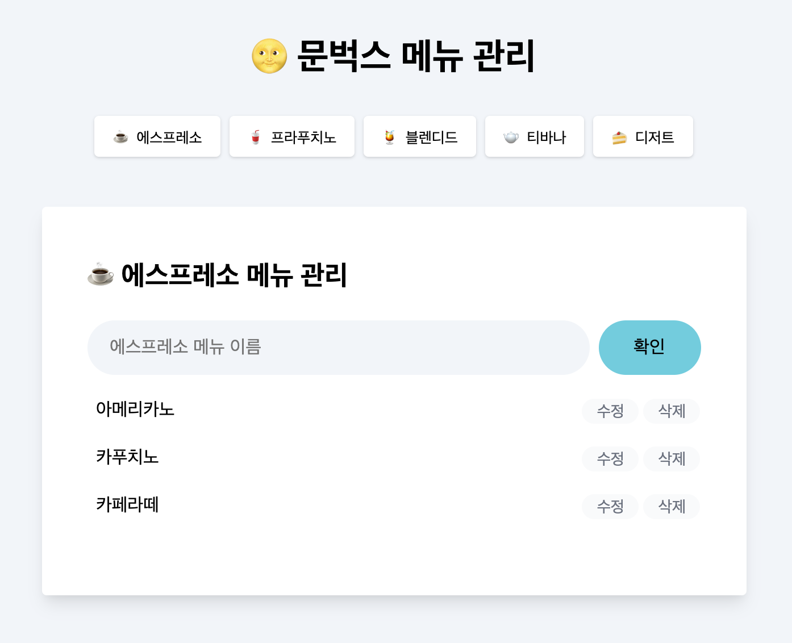

<br/>
<p align="middle">
  
</p>
<h2 align="middle">JS 문벅스 카페메뉴 앱</h2>
<p align="middle">Vanilla JS로 구현 하는 상태관리가 가능한 카페메뉴 앱</p>
<p align="middle">
  
  
  
  
  <a href="https://github.com/blackcoffee-study/js-lv1-book-manual/blob/main/LICENSE" target="_blank">
    
  </a>
</p>

<br/>

# ☕️ 코드리뷰 모임 - Black Coffee

<br/>

> '훌륭한 의사소통은 블랙커피처럼 자극적이며, 후에 잠들기가 어렵다'. <br> A.M. 린드버그(미국의 작가, 수필가) -

<br/>

블랙커피처럼 서로를 자극해주고, 동기부여 해주며, 그 성장과정으로 인해 의미있는 가치를 만들어내고자 하는  
**개발자 커뮤니티** ☕️ **Black Coffee**입니다.

<br/>

## 🔥 Projects!

<p align="middle">
  
</p>

<p align="middle">
  <a href="https://blackcoffee-study.github.io/moonbucks-menu/">🖥️ 데모 링크</a>
</p>

<br/>

## 🎯 step1 요구사항 - 돔 조작과 이벤트 핸들링으로 메뉴 관리하기

- [x] 에스프레소 메뉴에 새로운 메뉴를 확인 버튼 또는 엔터키 입력으로 추가한다.
  - [x] 메뉴가 추가되고 나면, input은 빈 값으로 초기화한다.
  - [x] 사용자 입력값이 빈 값이라면 추가되지 않는다.
- [x] 메뉴의 수정 버튼을 눌러 메뉴 이름 수정할 수 있다.
  - [x] 메뉴 수정시 브라우저에서 제공하는 `prompt` 인터페이스를 활용한다.
- [x] 메뉴 삭제 버튼을 이용하여 메뉴 삭제할 수 있다.
  - [x] 메뉴 삭제시 브라우저에서 제공하는 `confirm` 인터페이스를 활용한다.
- [x] 총 메뉴 갯수를 count하여 상단에 보여준다.
- 추가되는 메뉴의 아래 마크업은 `<ul id="espresso-menu-list" class="mt-3 pl-0"></ul>` 안에 삽입해야 한다.

```js
<li class="menu-list-item d-flex items-center py-2">
  <span class="w-100 pl-2 menu-name">${name}</span>
  <button
    type="button"
    class="bg-gray-50 text-gray-500 text-sm mr-1 menu-edit-button"
  >
    수정
  </button>
  <button
    type="button"
    class="bg-gray-50 text-gray-500 text-sm menu-remove-button"
  >
    삭제
  </button>
</li>
```

## 🎯 step2 요구사항 - 상태 관리로 메뉴 관리하기

- [ ] [localStorage](https://developer.mozilla.org/ko/docs/Web/API/Window/localStorage)에 데이터를 저장하여 새로고침해도 데이터가 남아있게 한다.
- [ ] 에스프레소, 프라푸치노, 블렌디드, 티바나, 디저트 각각의 종류별로 메뉴판을 관리할 수 있게 만든다.
  - [ ] 페이지에 최초로 접근할 때는 에스프레소 메뉴가 먼저 보이게 한다.
- [ ] 품절 상태인 경우를 보여줄 수 있게, 품절 버튼을 추가하고 `sold-out` class를 추가하여 상태를 변경한다.
- 품절 상태 메뉴의 마크업

```js
<li class="menu-list-item d-flex items-center py-2">
  <span class="w-100 pl-2 menu-name sold-out">${name}</span>
  <button
    type="button"
    class="bg-gray-50 text-gray-500 text-sm mr-1 menu-sold-out-button"
  >
    품절
  </button>
  <button
    type="button"
    class="bg-gray-50 text-gray-500 text-sm mr-1 menu-edit-button"
  >
    수정
  </button>
  <button
    type="button"
    class="bg-gray-50 text-gray-500 text-sm menu-remove-button"
  >
    삭제
  </button>
</li>
```
